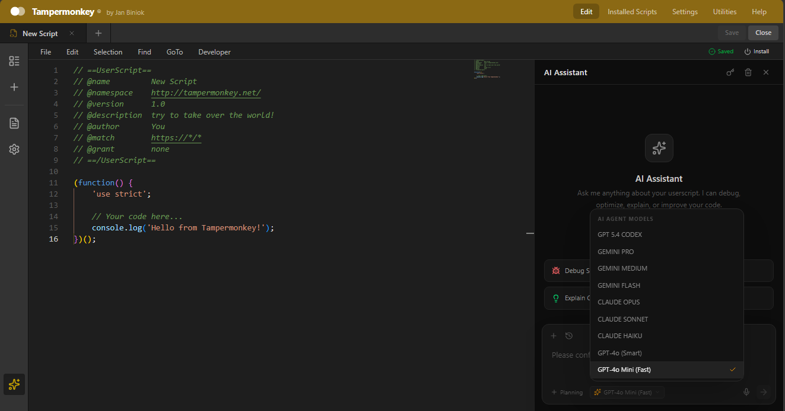

# 🐵 Tampermonkey Script Editor

> A professional, browser-based userscript editor inspired by the native Tampermonkey extension — with AI-powered assistance, real-time collaboration features, and a modern IDE experience.

[](LICENSE)
[](https://react.dev)
[](https://vitejs.dev)
[](https://tailwindcss.com)
[](https://www.typescriptlang.org)

---



---

## ✨ Features

### 📝 Professional Code Editor
- **Monaco Editor** (VS Code engine) with full JavaScript/TypeScript support
- Syntax highlighting for Tampermonkey metadata blocks
- IntelliSense, auto-completion, and error diagnostics
- Code folding, minimap, bracket matching, and line bookmarks
- Format document & collapse/expand functions

### 🤖 AI Assistant (Gravity-like)
- **Multi-Provider Support**: OpenAI, OpenRouter (Gemini, Claude, Opus, Codex)
- **9 AI Models**:
  - GPT 5.4 CODEX
  - GEMINI PRO / MEDIUM / FLASH
  - CLAUDE OPUS / SONNET / HAIKU
  - GPT-4o / GPT-4o Mini
- **Smart Context**: AI automatically reads your active script
- **Quick Actions**: Debug, Optimize, Explain, Improve Code
- **File Attachments**: Upload photos, code files, PDFs, CSVs
- **Streaming Responses** with markdown & code block rendering
- **One-Click Apply**: Apply AI-generated code directly to editor

### 📂 Script Management
- Create, edit, duplicate, delete userscripts
- Enable/disable scripts with one click
- Import `.user.js` files
- Export scripts as `.user.js`
- Search & filter installed scripts
- Persistent storage via localStorage

### 📋 Metadata Editor
- Visual form editor for all Tampermonkey metadata fields
- Auto-sync metadata block with code
- Support for `@match`, `@include`, `@exclude`, `@grant`, `@run-at`, etc.

### ⚙️ Editor Settings
- Theme selection (Dark / Light / High Contrast)
- Font size, word wrap, line numbers
- Tab size, minimap, insert spaces
- Custom Tampermonkey-dark theme

### 📌 Bookmarks
- Click line numbers to toggle yellow bookmarks
- Block selection + click to bookmark entire range
- Selection persists after bookmarking
- Bookmarks saved per script in localStorage

---

## 🚀 Getting Started

### Prerequisites
- [Node.js](https://nodejs.org/) >= 18.0.0
- npm or yarn

### Installation

```bash
# Clone the repository
git clone https://github.com/Delta-Polder-Indonesia/IDE-tempermonkey.git
cd tampermonkey-script-editor

# Install dependencies
npm install

# Start development server
npm run dev

# Build for production
npm run build
```

### AI Setup (Optional)
To use the AI Assistant feature:

1. Click the **Sparkles (✨)** icon in the left sidebar
2. Click the **Key (🔑)** icon to open settings
3. Enter your API key:
   - **OpenAI**: `sk-...`
   - **OpenRouter**: `sk-or-...` (supports Gemini, Claude, Opus)
4. Select your preferred AI model
5. Start chatting!

---

## 🛠️ Tech Stack

| Technology | Purpose |
|-----------|---------|
| **React 19** | UI Framework |
| **TypeScript** | Type Safety |
| **Vite** | Build Tool |
| **Tailwind CSS** | Styling |
| **Monaco Editor** | Code Editor (VS Code engine) |
| **Framer Motion** | Animations |
| **Lucide React** | Icons |
| **React Markdown** | AI Message Rendering |
| **Sonner** | Toast Notifications |

---

## 📁 Project Structure

```
tampermonkey-script-editor/
├── src/
│   ├── components/
│   │   ├── AIChatPanel.tsx      # AI Assistant panel
│   │   ├── CodeEditor.tsx       # Monaco Editor wrapper
│   │   ├── MetadataEditor.tsx   # Script metadata form
│   │   ├── SettingsPanel.tsx    # Editor settings
│   │   └── ScriptList.tsx       # Script sidebar (legacy)
│   ├── data/
│   │   └── defaultScripts.ts    # Sample userscripts
│   ├── hooks/
│   │   └── useScripts.ts        # Script management hook
│   ├── services/
│   │   └── aiService.ts         # AI API integration
│   ├── types.ts                 # TypeScript interfaces
│   ├── App.tsx                  # Main application
│   └── main.tsx                 # Entry point
├── public/
├── index.html
├── package.json
├── vite.config.ts
├── tsconfig.json
├── tailwind.config.js
├── LICENSE
├── CONTRIBUTING.md
└── README.md
```

---

## 🎯 Roadmap

- [x] Monaco Editor integration
- [x] AI Assistant with multi-provider support
- [x] Script management (CRUD)
- [x] Metadata editor
- [x] Bookmarks system
- [x] Import/Export `.user.js`
- [ ] Git sync for scripts
- [ ] Cloud backup (GitHub Gist)
- [ ] Collaborative editing
- [ ] Script marketplace integration
- [ ] Mobile-responsive layout
- [ ] Dark/Light theme toggle
- [ ] Plugin system

---

## 🤝 Contributing

We welcome contributions! Please read our [Contributing Guidelines](CONTRIBUTING.md) before submitting a pull request.

### Quick Start for Contributors

```bash
# Fork and clone
git clone https://github.com/Delta-Polder-Indonesia/IDE-tempermonkey.git
cd tampermonkey-script-editor

# Install dependencies
npm install

# Create a branch
git checkout -b feature/your-feature-name

# Make changes and commit
git add .
git commit -m "feat: add your feature"

# Push and create PR
git push origin feature/your-feature-name
```

---

## 📜 License

This project is licensed under the [MIT License](LICENSE) — feel free to use, modify, and distribute.

---

## 🙏 Acknowledgments

- [Tampermonkey](https://www.tampermonkey.net/) by Jan Biniok — the original inspiration
- [Monaco Editor](https://microsoft.github.io/monaco-editor/) by Microsoft
- [OpenAI](https://openai.com/) & [OpenRouter](https://openrouter.ai/) for AI APIs
- [Lucide](https://lucide.dev/) for beautiful icons

---

## 📧 Contact

- **Issues**: [GitHub Issues](https://github.com/Delta-Polder-Indonesia/IDE-tempermonkey/issues)
- **Discussions**: [GitHub Discussions](https://github.com/yourusername/tampermonkey-script-editor/discussions)

---

<p align="center">
  Made with ❤️ for the userscript community
</p>
